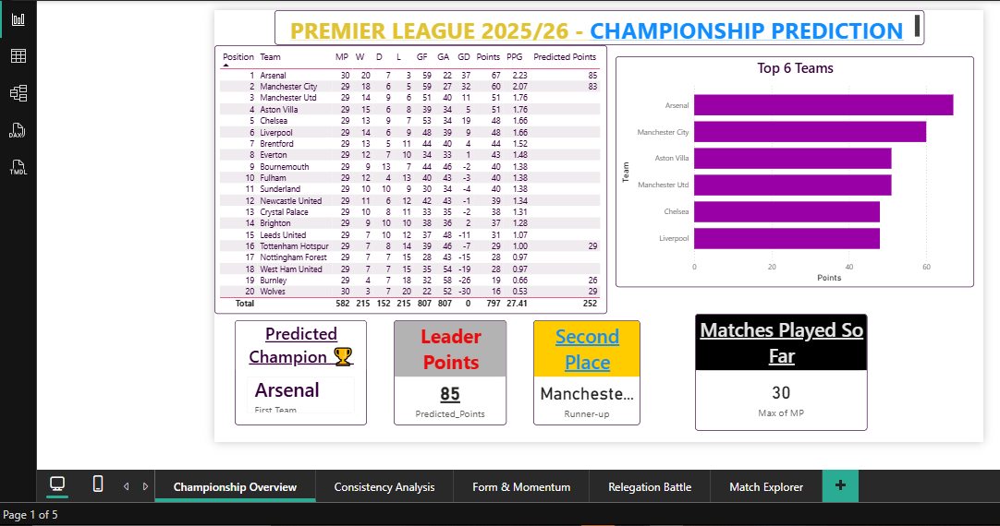
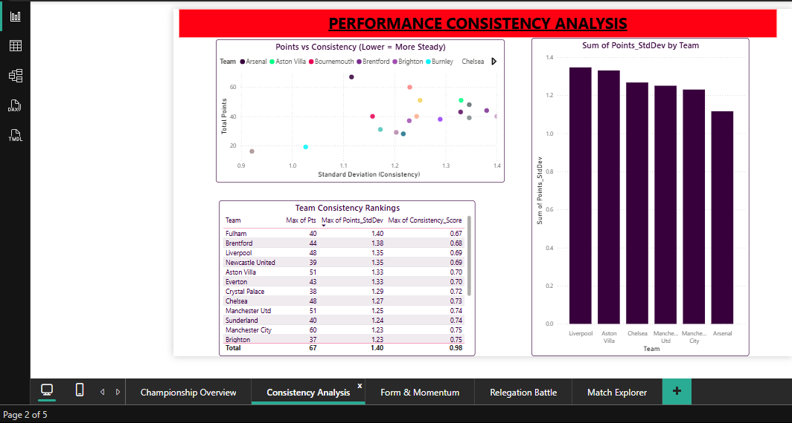
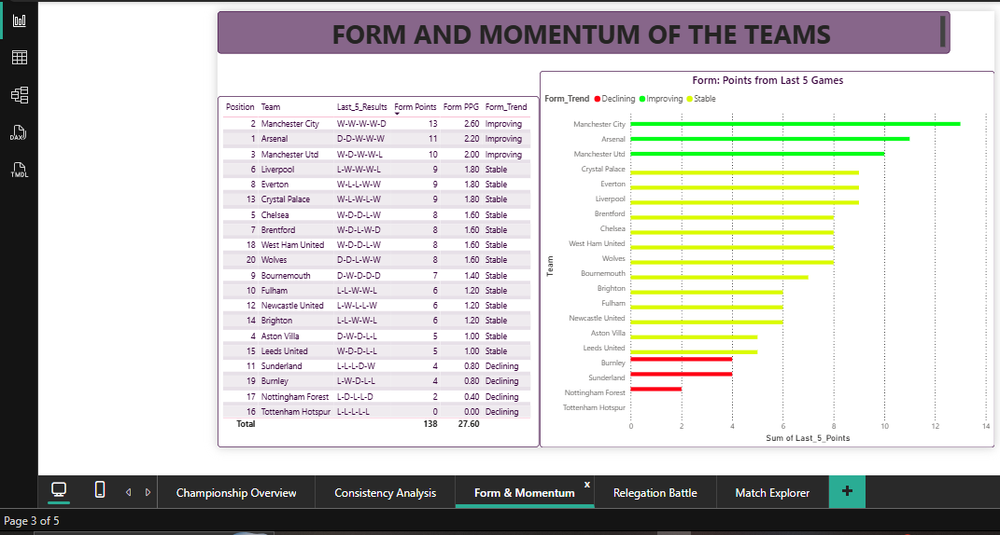
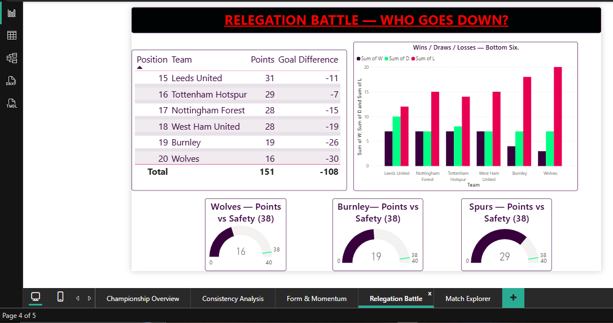
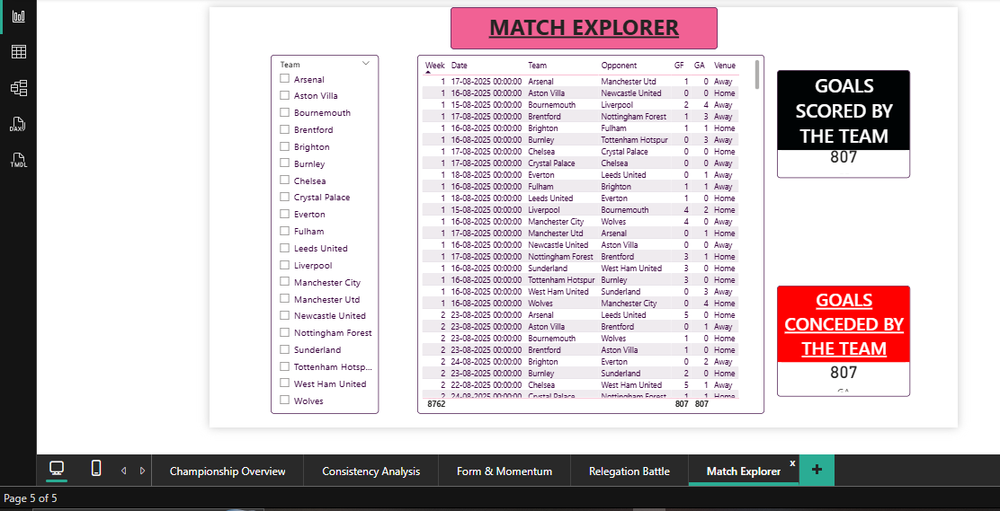

# Premier League 2025/26 Prediction Dashboard

A data analysis project that predicts the final outcomes of the 2025/26 Premier League season — champion, runner-up, and relegated teams — using match-results data processed in Python and visualised in an interactive Power BI dashboard.

---

## Project Overview

This project takes completed match results from the 2025/26 Premier League season, builds a full league table from scratch, engineers performance metrics (consistency and recent form/momentum), and applies a weighted prediction model to project how the season finishes.

The work spans the full analytics workflow: **data sourcing → processing in Python → metric engineering → prediction modelling → visualisation in Power BI.**

## Predictions

| Outcome | Team |
|---|---|
| 🏆 Predicted Champion | Arsenal |
| 🥈 Predicted Runner-up | Manchester City |
| 🔻 Predicted Relegation | Burnley, Wolves, Tottenham Hotspur |

> Note: The relegation picks reflect a blend of current league position and recent form rather than current standings alone — which is why Tottenham, mid-table on points but on a poor run of form, appears as a predicted faller.

## Methodology

**Data source:** Match-by-match results for the 2025/26 season (FBref), covering 291 completed fixtures.

**Processing (Python / Jupyter):**
- Loaded raw match results and computed a complete league table (points, wins/draws/losses, goals for/against, goal difference, points-per-game).
- Engineered a **consistency metric** (standard deviation of points returns) to measure how steady each team's performances were.
- Engineered a **form/momentum metric** based on points from each team's last 5 games.

**Prediction model:**
- Scored the top teams using a weighted formula combining current position, recent form, overall points-per-game, and consistency.
- Projected each team's final points total by extending current points with form-adjusted estimates for the remaining fixtures.
- The projected final points total determines the champion and runner-up ranking.

## Dashboard

The Power BI dashboard is organised into five pages:

1. **Championship Overview** — full standings table, points-by-team chart, and prediction cards (champion, runner-up, leader points, matches played).
2. **Consistency Analysis** — scatter and column visuals exploring which teams were most/least consistent.
3. **Form & Momentum** — a form table and a trend-coloured chart showing which teams are improving, stable, or declining.
4. **Relegation Battle** — danger-zone table, a wins/draws/losses breakdown of the bottom six, and gauges showing each predicted relegated team's points against the survival line.
5. **Match Explorer** — an interactive page with a team slicer that filters every match (home and away) plus goals scored/conceded for the selected team.
## Dashboard Preview

### 1. Championship Overview


### 2. Consistency Analysis


### 3. Form & Momentum


### 4. Relegation Battle


### 5. Match Explorer

## Tech Stack

- **Python** (pandas) — data processing and metric engineering
- **Jupyter Notebook** — analysis workflow
- **Power BI Desktop** — interactive dashboard and DAX
- **Excel / CSV** — processed data intermediaries
- **FBref** — match results data source

## Repository Contents

```
├── README.md
├── PL_Winner_Analysis_2026.ipynb        # Python data processing & prediction notebook
├── data/
│   ├── PL_Match_Results_2025_26.csv      # Raw match results
│   ├── PL_Analysis_Processed_Data.xlsx   # Processed workbook (standings, consistency, form)
│   └── PL_Predictions_Summary.csv        # Final prediction outputs
├── dashboard/
│   └── Premier_league_predictions.pbix   # Power BI dashboard file
└── screenshots/
    ├── 01-championship-overview.png
    ├── 02-consistency-analysis.png
    ├── 03-form-momentum.png
    ├── 04-relegation-battle.png
    └── 05-match-explorer.png
```

## How to View

- **Dashboard screenshots** are in the `screenshots/` folder — the quickest way to see the work.
- To explore interactively, open `Premier_league_predictions.pbix` in [Power BI Desktop](https://powerbi.microsoft.com/desktop/) (free).
- To review the analysis, open `PL_Winner_Analysis_2026.ipynb` (viewable directly on GitHub).

## Disclaimer

This is a portfolio project for demonstrating data analysis and visualisation skills. The predictions are illustrative model outputs based on partial-season data, not betting advice or definitive forecasts.

---

*Built as a portfolio project combining Python data processing with Power BI visualisation.*
